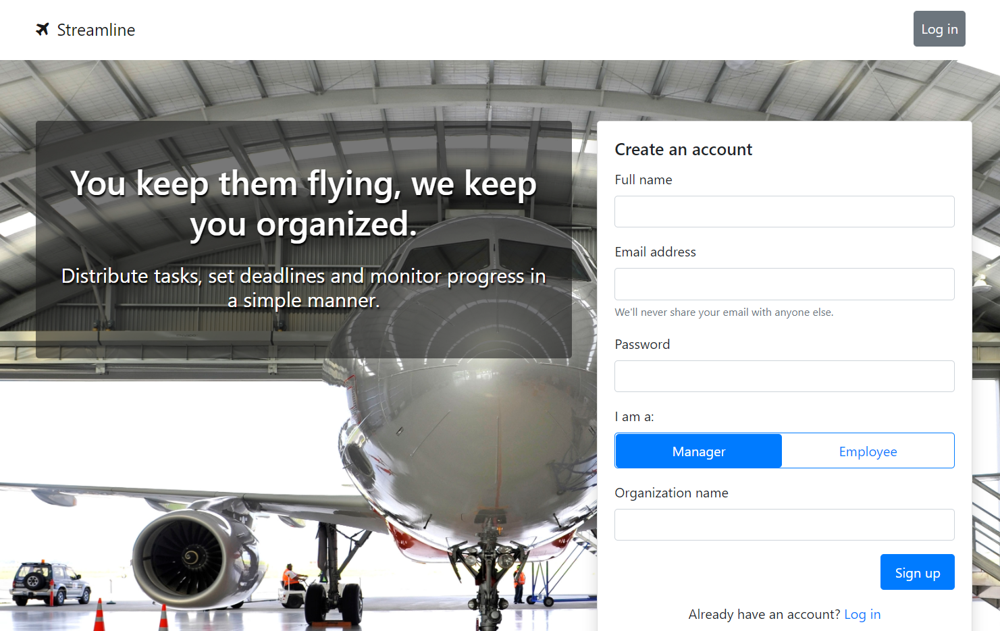
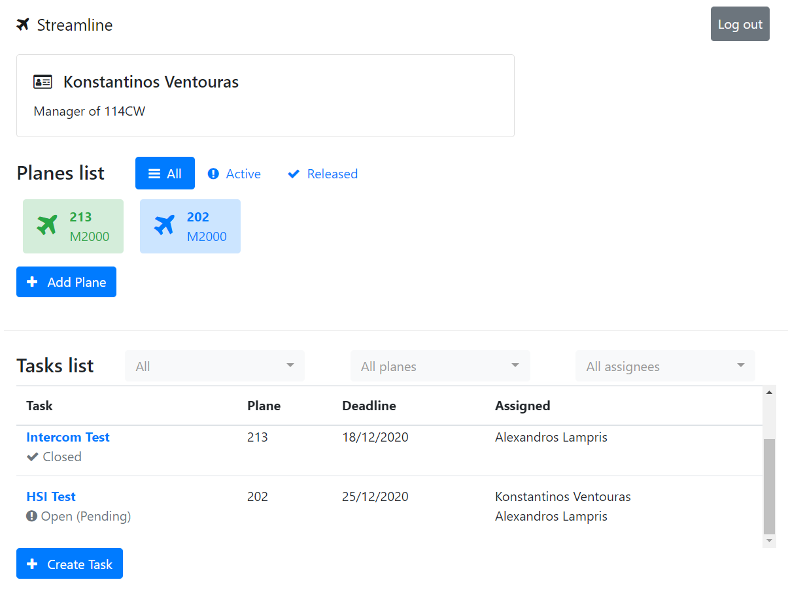

# Streamline
Personal capstone project for Responsive Website Design specialization on Coursera.

## Description
Intended to be a web app for logging and tracking tasks carried out in an aircraft maintenance organization (AMO).

### Done
* Landing page
* Login/Register (as manager or employee)
* Create/edit planes
* Release to service/take in for maintenance
* Add/edit tasks
* Assign tasks
* Close tasks

### To Do
* Profile info edit
* Invite/approve employees by manager
* Mass import/export tasks (to reuse on other planes)
* Generate/display statistics?

## Preview

